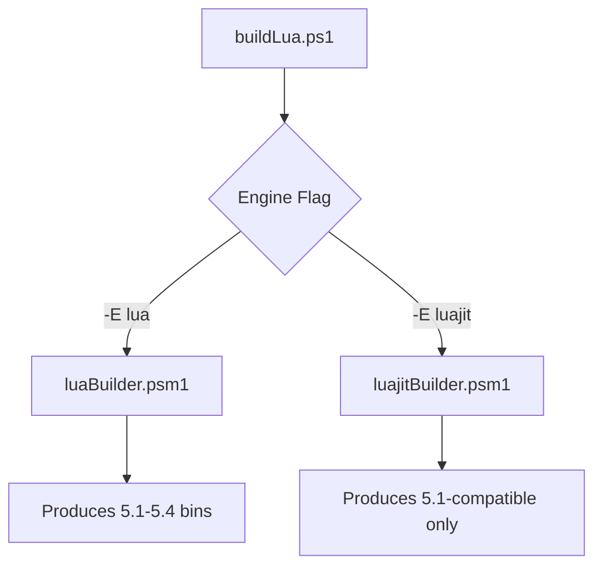

# Lua/LuaJIT Build System

**Quick Start Guide for Developers**

---

## 🚀 Getting Started

### Prerequisites

| Platform | Requirements |
| --- | --- |
| **All Systems** | PowerShell 5.1+ or PowerShell 7+ |
| **Windows** | [Strawberry Perl](https://strawberryperl.com/) (includes GCC/make) |
| **Linux/macOS** | Standard build tools (`make`, `gcc`) |

> 💡 Run setup scripts first:
> 
> ```powershell
> # Windows
> .\luaDev-prereqs.ps1
> 
> # Linux/macOS
> ./luaDev-prereqs.sh
> ```

---

## 🔧 First Build

## Basic Workflow

```powershell
# Navigate to scripts directory
cd luaDev/scripts

# Build all supported Lua versions
.\buildLua.ps1

# Build specific versions with LuaJIT

.\buildLua.ps1 -Versions 514,548 -Engines lua,luajit
```

---

## Key Commands Cheatsheet

| Command | Description | Example |
| --- | --- | --- |
| `.\buildLua.ps1` | Build latest Lua versions |     |
| `.\buildLua.ps1 -V [version]` | Build specific version (shorthand) | `-V 514` → Lua 5.1.4 |
| `.\buildLua.ps1 -E [engine]` | Select build engine | `-E luajit` |
| `.\buildLua.ps1 -LL [level]` | Set log level | `-LL Debug` |

---

## 📂 Project Structure

**project structure with detailed annotations:**

```plaintext
luaDev/                          # 🏠 PROJECT ROOT
│
├── LuaBinaries/                  # 💻 COMPILED BINARIES (final output)
│   ├── lua-5.1.5-windows-x64/    #   └─ Windows build (Lua 5.1.5)
│   │   ├── bin/                  #       Executables (lua.exe, luac.exe)
│   │   ├── lib/                  #       Libraries (lua51.dll, lua51.lib)
│   │   └── include/              #       Headers (lua.h, luaconf.h)
│   │
│   ├── lua-5.4.8-linux-arm64/    #   └─ Linux ARM build
│   ├── luajit-2.1.0-macos-x64/   #   └─ macOS LuaJIT build
│   └── ...                       #   Additional version/platform combos
│
├── manifests/                    # 📊 BUILD REPORTS & METADATA
│   ├── manifest.json             #   Machine-readable build summary
│   ├── manifest.md               #   Human-friendly report (Markdown)
│   ├── metrics.json              #   [Future] Build performance data
│   └── errors.log                #   [Future] Consolidated error logs
│
├── scripts/                      # ⚙️ BUILD SYSTEM CORE
│   │
│   ├── buildLua.ps1              #   MAIN ENTRY POINT (PowerShell)
│   ├── luaDev-prereqs.ps1        #   Windows dependency installer
│   ├── luaDev-prereqs.sh         #   Linux/macOS dependency installer
│   │
│   ├── logs/                     #   📝 EXECUTION LOGS
│   │   ├── buildLua.ps1.log      #     Main build log
│   │   ├── luaBuilder.log        #     Lua-specific build log
│   │   ├── luajitBuilder.log     #     LuaJIT-specific build log
│   │   └── downloader.log        #     Source download log
│   │
│   └── modules/                  #   🧩 MODULAR COMPONENTS (PS Modules)
│       ├── globals.psm1          #     Paths and constants
│       ├── logging.psm1          #     Logging utilities
│       ├── environment.psm1      #     OS/arch detection
│       ├── versioning.psm1       #     Version handling
│       ├── downloader.psm1       #     Source downloader
│       ├── luaBuilder.psm1       #     Lua build engine
│       ├── luajitBuilder.psm1    #     LuaJIT build engine
│       └── manifest.psm1         #     Report generation
│
├── sources/                      # 📦 DOWNLOADED SOURCE CODE
│   ├── lua-5.1.5.tar.gz          #   Lua source archives
│   ├── lua-5.4.8.tar.gz
│   └── LuaJIT/                   #   Git-cloned LuaJIT repo
│       ├── src/
│       ├── Makefile
│       └── ...
│
└── docs/                         # 📚 DOCUMENTATION (optional)
    ├── build-guide.md            #   Detailed build instructions
    └── module-reference/         #   Auto-generated API docs
```

## Key Directory Explanations:

| Path | Purpose | Critical Contents |
| --- | --- | --- |
| **`LuaBinaries/`** | Final build outputs | Platform-specific binaries organized by version/engine |
| **`manifests/`** | Build metadata | `manifest.json` (CI integration), `manifest.md` (human review) |
| **`scripts/modules/`** | Build system core | `*Builder.psm1` (build engines), `downloader.psm1` (source mgmt) |
| **`scripts/logs/`** | Diagnostic data | Per-module logs with timestamps and error details |
| **`sources/`** | Source artifacts | Downloaded .tar.gz files and cloned repositories |
| **`docs/`** | Documentation | Usage guides and module references (optional) |

### File Manifest:

| File | Location | Purpose |
| --- | --- | --- |
| `buildLua.ps1` | `scripts/` | Main orchestration script |
| `luaBuilder.psm1` | `scripts/modules/` | Standard Lua build logic |
| `luajitBuilder.psm1` | `scripts/modules/` | LuaJIT-specific build logic |
| `manifest.json` | `manifests/` | Machine-consumable build report |
| `buildLua.ps1.log` | `scripts/logs/` | Primary debug log |
| `lua-5.4.8.tar.gz` | `sources/` | Downloaded Lua source |
| `lua.exe` | `LuaBinaries/lua-5.4.8-windows-x64/bin/` | Final executable |

### Structure Notes:

1. **Separation of Concerns**  
  Sources, binaries, and scripts are isolated to prevent contamination
  
2. **Platform-Neutral Paths**  
  All paths use forward slashes for cross-platform compatibility
  
3. **Extensible Logging**  
  Log directory supports adding per-version build logs
  
4. **CI/CD Ready**  
  `manifest.json` provides structured data for automation pipelines
  

> 💡 **Pro Tip**: Use `tree /F` (Windows) or `tree` (Unix) to generate live directory maps

---

## ⚠️ Critical Compatibility Notes

### Lua vs. LuaJIT

| **Aspect** | **Lua** | **LuaJIT** |
| --- | --- | --- |
| **Versions** | 5.1.x, 5.2.x, 5.3.x, 5.4.x | 5.1-compatible only |
| **Source** | [lua.org ftp](https://www.lua.org/ftp/) | [GitHub](https://github.com/LuaJIT/LuaJIT) |
| **Build Module** | `luaBuilder.psm1` | `luajitBuilder.psm1` |
| **Output Example** | `lua-5.4.8-windows-x64` | `luajit-2.1.0-macos-x64` |



### Key Limitations

1. LuaJIT **cannot** execute Lua 5.3/5.4 code with new features
2. Concurrent builds are independent (no shared state)
3. Binaries are platform-specific (no cross-compilation)

---

## 🔍 Troubleshooting

### Common Issues & Solutions

| Issue | Solution |
| --- | --- |
| **Missing build tools** | Run platform-specific setup script |
| **Permission errors** | `Run as administrator` (Windows) |
| **Version not found** | Check [lua.org](https://www.lua.org/versions.html) |
| **Source download fails** | Retry with `-LL Debug` for details |

### Log Inspection

```powershell
# Check main build log
code scripts/logs/buildLua.ps1.log

# Verify build status
cat manifests/manifest.md
```

---

## 📊 Manifest Files

### Purpose

- Track build artifacts and outcomes
- Provide CI/CD integration points
- Document build environments

### Example manifest.md

```markdown
## Build Report
| Engine  | Version | Platform  | Arch   | Status   | Path                              |
|---------|---------|-----------|--------|----------|-----------------------------------|
| lua     | 5.4.8   | windows   | x64    | ✅ Success | LuaBinaries/lua-5.4.8-windows-x64 |
| luajit  | 2.1.0   | macos     | arm64  | ✅ Success | LuaBinaries/luajit-2.1.0-macos-arm64 |
```

---

## ✔️ Support Matrix

| Version | Windows | Linux | macOS |
| --- | --- | --- | --- |
| Lua 5.1.x | ✅   | ✅   | ✅   |
| Lua 5.2.x | ✅   | ✅   | ✅   |
| Lua 5.3.x | ✅   | ✅   | ✅   |
| Lua 5.4.x | ✅   | ✅   | ✅   |
| LuaJIT 2.1 | ✅   | ✅   | ✅   |

---

## 💡 Pro Tips

1. **Automate Updates**  
  Schedule daily builds without version specs
  
  ```powershell
  .\buildLua.ps1 -LogLevel Silent
  ```
  
2. **CI/CD Integration**  
  Exit code `0` = success, `1` = failure
3. **Artifact Verification**  
  Validate binaries using manifest metadata
4. **Custom Builds**  
  Modify parameters in:
  - `modules/versioning.psm1` (version sources)
  - `modules/globals.psm1` (output paths)
