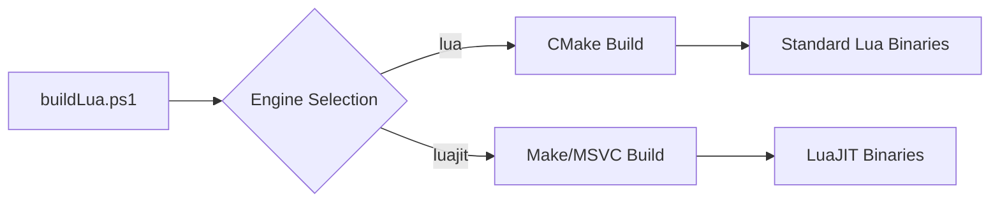
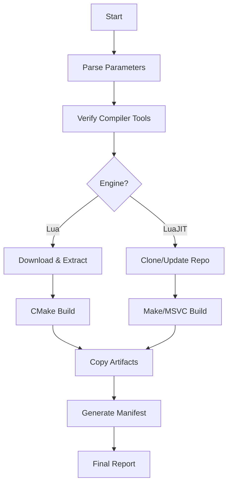

## Introduction

A **Windows-native automation solution** for building Lua (5.1-5.4) and LuaJIT binaries featuring configurable compiler support, build types, and artifact tracking. Provides consistent Lua environments for Windows development with Clang, MingW, and MSVC toolchains.

---

## 🔧 Multi-Compiler Support

| Compiler | Lua | LuaJIT | Requirements |
| --- | --- | --- | --- |
| **Clang/LLVM** | ✅ | ✅ | LLVM toolchain |
| **MingW/GCC** | ✅ | ✅ | MingW installation |
| **MSVC** | ✅ | ✅ | Visual Studio Build Tools |

### 🔄 Build Configuration

```powershell
# Static build with Clang
.\buildLua.ps1 -BuildType static -Compiler clang

# Shared build with MingW
.\buildLua.ps1 -BuildType shared -Compiler mingw

# LuaJIT with MSVC
.\buildLua.ps1 -Engines luajit -Compiler msvc
```

---

### 🧩 Flexible Build Options

- **Static/Shared Libraries**: Toggle with `-BuildType`
- **Engine Selection**: Build `lua`, `luajit`, or both
- **Version Control**: Specific versions or auto-detect latest
- **Parallel Compilation**: Uses all CPU cores by default

### 📂 Structured Artifact Output

```tree
binaries/
├── lua-5.4.8-static-clang-x64/   # Static Clang build
│   ├── lua.exe
│   └── lua54.lib
├── lua-5.4.8-shared-mingw-x64/    # Shared MingW build
│   ├── lua.exe
│   └── lua54.dll
└── luajit-2.1.0-static-msvc-x64/  # LuaJIT MSVC build
    ├── luajit.exe
    └── lua51.lib
```

### 🩺 Comprehensive Diagnostics

- 5 log levels: `Silent` → `Debug`
- Build timing metrics
- Color-coded status indicators
- Per-engine log files

---

## Build Engine Architecture

### Implementation Differences

| **Engine** | **Build System** | **Output** |
| --- | --- | --- |
| **Lua** | CMake-based | Static/shared EXE+LIB/DLL |
| **LuaJIT** | Make/msvcbuild | Static/shared EXE+LIB/DLL |



### Key Capabilities

1. **Compiler Flexibility**  
   Switch between Clang, MingW, and MSVC with parameter
2. **Build Type Toggle**  
   Static vs shared linking via `-BuildType`
3. **Artifact Organization**  
   Output directories include version/buildtype/compiler
4. **Source Caching**  
   Downloads stored in `sources/` for faster rebuilds

---

## System Components

### Core Architecture

| Component | Functionality |
| --- | --- |
| `buildLua.ps1` | Main orchestration script |
| `modules/*.psm1` | Modular PowerShell components |

### Key Modules

1. **Compiler Handling**  
   - MSVC: Uses `msvcbuild.bat` for LuaJIT  
   - Clang: Uses CMake with Ninja generator  
   - MingW: GNU-compatible builds
2. **Version Management**  
   - Shorthand expansion (`548` → `5.4.8`)  
   - Web scraping for latest releases
3. **Artifact Tracking**  
   - JSON/Markdown manifests  
   - Build metadata capture
4. **Diagnostics**  
   - CPU core detection  
   - Architecture identification (x64/arm64)

---

## Quick Start

### Basic Usage

```powershell
# Build latest Lua versions with default (Clang static)
.\buildLua.ps1

# Build Lua 5.4.8 shared with MingW
.\buildLua.ps1 -Versions 548 -BuildType shared -Compiler mingw

# Build LuaJIT static with MSVC
.\buildLua.ps1 -Engines luajit -BuildType static -Compiler msvc
```

### Parameters

| Parameter | Values | Default |
| --- | --- | --- |
| `-Versions` | `514`, `5.4.8`, etc. | Auto-detected |
| `-Engines` | `lua`, `luajit` | `lua` |
| `-BuildType` | `static`, `shared` | `static` |
| `-Compiler` | `clang`, `mingw`, `msvc` | `clang` |
| `-LogLevel` | `Silent`-`Debug` | `Info` |

### Sample Output

```
🚀 Starting Lua/LuaJIT build automation (Windows)
🔧 Configuration: BuildType=static, Compiler=clang
🔧 Build targets: lua, luajit
📦 Building Lua 5.4.8 (static) with clang
✅ Built Lua 5.4.8 successfully
⚡ Building LuaJIT (static) with clang
✅ Built LuaJIT 2.1.0 successfully
📝 Manifests saved to C:\luaDev\manifests
🏁 Completed in 4.2m | Success: 2/2
  ✅ [lua] 5.4.8 (static/clang)
  ✅ [luajit] 2.1.0 (static/clang)
```

---

## Build Workflow



---

## Customization Options

1. **Version Sources**  
   Modify `Get-LatestLuaVersions` in `versioning.psm1`
2. **Build Flags**  
   Adjust CMake parameters in `luaBuilder.psm1`
3. **Output Locations**  
   Edit paths in `globals.psm1`
4. **Artifact Contents**  
   Modify copy operations in builder modules

---

## Troubleshooting

| Issue | Solution |
| --- | --- |
| Compiler not found | Run prerequisites script |
| Build failures | Check compiler-specific logs |
| Network issues | Use `-LogLevel Debug` |
| Version not found | Verify on [lua.org](https://www.lua.org/versions.html) |

---

## Best Practices

1. **Incremental Builds**  
   Source archives cached in `sources/` directory
2. **CI/CD Integration**  
   ```powershell
   .\buildLua.ps1 -LogLevel Silent
   # Exit code: 0 = success, 1 = failure
   ```
3. **Artifact Verification**  
   Validate binaries using generated manifests
4. **Parallel Building**  
   Automatic CPU core utilization

---

## Requirements

| Component | Requirement |
| --- | --- |
| **OS** | Windows 10/11 |
| **PowerShell** | 5.1+ |
| **Tools** | Git, CMake, Compiler toolchain |

> **Note**: All dependencies installable via `.\luaDev-prereqs.ps1`

---

## Explore Further

[Build Examples](/docs/examples) • [API Reference](/docs/api) • [Troubleshooting Guide](/docs/troubleshooting)
